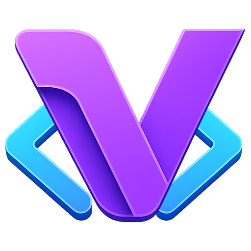

# VisuAlg Studio

<p align="center">
  
</p>

<p align="center">
  <strong>Uma IDE moderna, rápida e intuitiva para o aprendizado de algoritmos em Portugol.</strong>
</p>

<p align="center">
  <a href="https://github.com/elvis7t/visualg-studio/releases">
    
  </a>
  <a href="https://github.com/elvis7t/visualg-studio/actions/workflows/ci.yml">
    
  </a>
  <a href="https://github.com/elvis7t/visualg-studio/releases">
    
  </a>
  <a href="https://github.com/elvis7t/visualg-studio">
    
  </a>
  <a href="LICENSE">
    
  </a>
</p>

---

VisuAlg Studio é uma reconstrução desktop moderna do clássico Visualg, desenvolvida em **Electron** e **Node.js**. O objetivo do projeto é oferecer uma experiência de desenvolvimento leve, estável e visualmente agradável para escrever, executar e depurar algoritmos `.alg`, mantendo compatibilidade progressiva com a linguagem Visualg tradicional.

> [!IMPORTANT]
> **Nota de Isenção de Responsabilidade:** Este é um projeto **independente e não oficial**, sem qualquer vínculo com os mantenedores ou autores originais do software VisuAlg. Ele foi criado como uma homenagem ao legado educacional da ferramenta e para modernizar o ecossistema de aprendizado de Portugol.

> [!NOTE]
> **Sobre aprender a programar:** Programar não é um ato mecânico. A cada minuto, tomamos decisões que exigem ponderação, julgamento cuidadoso e responsabilidade sobre o que o código faz. Quando um desenvolvedor deixa de pensar ativamente sobre o próprio código, passa a depender do acaso: o programa pode até funcionar, mas sem uma razão clara, compreendida e defensável.
>
> Ferramentas de inteligência artificial podem apoiar o estudo, acelerar descobertas e ajudar na revisão, mas não devem substituir esse fundamento. A capacidade de raciocinar sobre problemas, escolhas e consequências é essencial para formar desenvolvedores com pensamento crítico.

---

## 🚀 Instalação Rápida

As versões compiladas e prontas para uso estão disponíveis na aba **[Releases](https://github.com/elvis7t/visualg-studio/releases)** do repositório.

| Plataforma | Artefato | Uso recomendado |
| --- | --- | --- |
| Windows | `VisuAlg Studio Setup X.Y.Z.exe` | Instalador padrão |
| Windows | `VisuAlg-Studio-Portable-Windows.zip` | Versão portátil |
| Linux | `VisuAlg Studio-X.Y.Z.AppImage` | Execução direta na maioria das distribuições |
| Linux | `visualg-studio_X.Y.Z_amd64.deb` | Instalação em Debian/Ubuntu |
| Verificação | `SHA256SUMS.txt` | Conferência de integridade dos arquivos |

---

## ✨ Funcionalidades Principais

* **Editor Premium:** Baseado em CodeMirror 6, com numeração de linhas, realce de linha ativa, guias de indentação inteligentes e busca/substituição integradas.
* **IntelliSense/Autocomplete:** Sugestões inteligentes para comandos do Visualg e variáveis declaradas no bloco `var`.
* **Temas Modernos:** Suporte a temas escuros como Dracula, Dark e Visual Assist Dark.
* **Depuração Interativa Avançada:** Depure seus algoritmos passo a passo com comandos de `Avançar`, `Voltar` (histórico de execução), continuar até pontos de parada (breakpoints) e reiniciar.
* **Inspeção de Expressões:** Avalie expressões dinamicamente em tempo de execução (ex: `baixo + alto` ou `vetor[i]`).
* **Geração de Fluxogramas:** Visualize seu algoritmo automaticamente em forma de fluxograma interativo (com zoom e pan) e exporte para SVG ou PNG.
* **Documentação & Dicas:** Guias integrados de atalhos, comandos da linguagem e painel interativo de ajuda na barra lateral.
* **Atualizações Automáticas:** Verifique e baixe novas versões do aplicativo diretamente pela tela *Sobre* (integrado ao GitHub Releases via auto-updater).

---

## ⚙️ Compatibilidade da Linguagem

A IDE possui um interpretador próprio desenvolvido em Node.js com suporte a:

* **Estrutura básica:** `algoritmo`, `var`, `inicio`, `fimalgoritmo`.
* **Tipos de dados:** `inteiro`, `real`, `caracter`/`caractere`, `logico`.
* **Estruturas de dados:** `vetor[1..N] de tipo` e matrizes multidimensionais.
* **Atribuições e operadores:** Suporte a `<-` e `:=`, além de operadores aritméticos, lógicos e relacionais.
* **Entrada e saída:** `escreva`, `escreval` (com formatação de casas decimais como `valor:6:2`) e `leia` (com modal interativo).
* **Estruturas de controle:** `se/senao`, `para/ate/passo`, `enquanto`, `repita/ate` e `escolha/caso/outrocaso`.
* **Modularização:** `procedimento` e `funcao` com parâmetros por valor e referência (`var`), recursão e retorno com `retorne`.
* **Funções nativas:** Funções matemáticas (`abs`, `raizq`, `sen`, `cos`, `tan`, `log`, `rand`, etc.) e manipulação de strings (`compr`, `maiusc`, `copia`, `pos`, `caracpnum`, etc.).
* **Controles especiais:** `limpatela`, `pausa`, `timer`, `cronometro`, `aleatorio` e `eco`.

---

## 🗺️ Roadmap e Status do Projeto

Abaixo estão os marcos técnicos e o status atual do desenvolvimento:

- [x] Execução de algoritmos em ambiente isolado (Web Worker)
- [x] Depurador interativo com avanço, retrocesso e breakpoints
- [x] Inspeção de variáveis e expressões em tempo de execução
- [x] Geração automática de fluxograma interativo
- [x] Atualizações automáticas integradas
- [ ] Step-into dedicado para subprogramas (funções e procedimentos)
- [ ] Layout avançado do fluxograma com tratamento de desvios em colunas
- [ ] Persistência de breakpoints entre sessões de uso

---

## 🛠️ Desenvolvimento e Contribuição

Se deseja contribuir ou testar as alterações no código localmente:

### Pré-requisitos
* Node.js (v20 ou superior)
* NPM

### Como rodar localmente
1. Instale as dependências a partir do lockfile:
   ```bash
   npm ci
   ```
2. Inicie o aplicativo em modo de desenvolvimento:
   ```bash
   npm start
   ```

### Scripts úteis
* **Verificar código (Testes e Sintaxe):** `npm run verify`
* **Testes unitários:** `npm test`
* **Executar cobertura de testes:** `npm run test:coverage`
* **Gerar bundle do renderer:** `npm run build:renderer`
* **Gerar ZIP portátil para Windows:** `npm run portable:win`
* **Compilar instalador para Windows:** `npm run dist:win`
* **Compilar pacotes para Linux:** `npm run dist:linux`

Para diretrizes detalhadas de estilo de código, fluxo de trabalho e abertura de Pull Requests, consulte o nosso **[Guia de Contribuição (CONTRIBUTING.md)](CONTRIBUTING.md)**. Todos os colaboradores devem seguir o nosso **[Código de Conduta (CODE_OF_CONDUCT.md)](CODE_OF_CONDUCT.md)**.

---

## 📂 Estrutura do Projeto

```text
.
├── .github/           # Workflows do GitHub Actions (CI/CD)
├── docs/              # Documentação operacional, specs e ADRs
├── examples/          # Algoritmos de exemplo carregados pela interface
├── resources/         # Ícones do app e identidade visual
├── scripts/           # Scripts de compilação e verificação de sintaxe
├── src/
│   ├── interpreter/   # Parser, runtime e interpretador do Portugol
│   ├── main/          # Processo principal do Electron
│   └── renderer/      # Interface gráfica (HTML/CSS/JS) e editor
└── test/              # Suíte de testes automatizados
```

Para mais detalhes sobre as decisões técnicas tomadas, você pode ler as nossas **[Decisões de Arquitetura (ADRs)](docs/adrs)**.

---

## 📄 Licença

Este projeto está licenciado sob a **[MIT License](LICENSE)**.

---

## 💖 Créditos e Homenagem

Este projeto é uma iniciativa independente e não possui vínculo direto com os criadores originais do software legado. Ele nasce como uma profunda homenagem ao impacto educacional do ecossistema Visualg:

*   O **Visualg** original foi idealizado e criado pelo professor **Claudio Morgado**.
*   Posteriormente, o projeto foi mantido, promovido e ampliado pelo professor **Antonio Carlos Nicolodi**.

O **VisuAlg Studio** busca perpetuar esse legado facilitando o ensino de lógica para novas gerações de desenvolvedores com ferramentas de desenvolvimento contemporâneas.


---

<div align="center">
  <p>⭐ Se este projeto te ajudou ou ajudará seus alunos, deixe uma estrela no repositório! Contribuições são sempre bem-vindas.</p>
</div>
